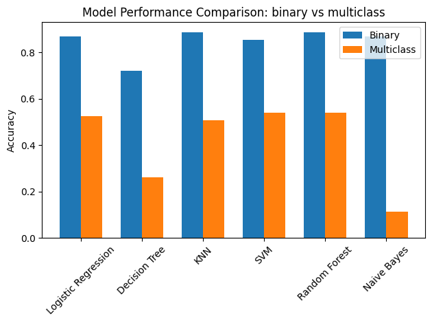

# Heart Disease Prediction Project

### PulsePredictors
Machine Learning Heart Disease Prediction using Cleveland Heart Disease Dataset
* Rabiat Sadiq 
* Juan Casillas

## Overview
Project Description and Objective: The project aims to use Machine learning to predict the likelihood of heart disease using patient data from the Cleveland Heart Disease dataset. The objective is to build a machine learning model to classify patients based on their medical data, as either showing signs of or having heart disease/condition using features such as age, cholesterol level, and blood pressure. The project includes both binary classification (presence/absence of heart disease) and multiclass classification (levels 0-4 of heart disease severity).

## Dataset Description
The Cleveland Heart Disease dataset contains 303 instances with 14 attributes:

| Feature | Description |
|---------|------------|
| age | Age in years |
| sex | Sex (1 = male, 0 = female) |
| cp | Chest pain type (1: typical angina, 2: atypical angina, 3: non-anginal pain, 4: asymptomatic) |
| trestbps | Resting blood pressure (in mm Hg) |
| chol | Serum cholesterol in mg/dl |
| fbs | Fasting blood sugar > 120 mg/dl (1 = true; 0 = false) |
| restecg | Resting electrocardiographic results |
| thalach | Maximum heart rate achieved |
| exang | Exercise induced angina (1 = yes; 0 = no) |
| oldpeak | ST depression induced by exercise relative to rest |
| slope | Slope of the peak exercise ST segment |
| ca | Number of major vessels colored by fluoroscopy (0-3) |
| thal | Thalassemia (3 = normal; 6 = fixed defect; 7 = reversible defect) |
| target | Diagnosis of heart disease (0-4) |


## Setup and Installation

```bash

#Download Raw file
For this you can download the raw file using the "raw" button, save the file and run on any python IDE of your choice

# or clone the repository
git clone https://github.com/username/PulsePredictor-ML.git

# Create virtual environment
python -m venv env

# Activate virtual environment
source env/bin/activate  # Linux/Mac
env\Scripts\activate     # Windows

# Install required packages
pip install -r requirements.txt

# Update your cloned repo:
git pull
```


## Project timeline and milestones:

- 1. Preprocess and complete Dataset analysis and EDA - Wednesday, October 9, 2024
- 2. Select Models based on clean dataset - Wednesday, October 16, 2024
- 3. Fine tune and work on hyperparameters - Wednesday, October 30, 2024
- 4. Compare Model testing accuracy - Wednesday, November 13, 2024
- 5. Work on improving and selecting best model accuracy - Wednesday, November 14, 2024
- 6. Present Findings, Final reports, and presentation - Thursday, November 21, 2024

# Selected machine learning application and its significance:

Currently, heart disease is one of the leading causes of death worldwide. It is known that early detection of heart disease can significantly reduce the effects of heart complications and allows for medical help to begin working effectively. We can use machine learning to identify the likelihood of heart disease based on different objective data like blood pressure, cholesterol, age, blood sugar, etc. This could help prevent several heart conditions from getting worse, leading to both better healthcare and heart disease severity prevention with a more personalized treatment plan based on the ML prediction.


## Data Preprocessing
1. **Handling Missing Values**
   - Filled missing values in 'ca' using mode
   - Filled missing values in 'thal' using mode

2. **Feature Scaling**
   - StandardScaler applied to numerical features
   - Label encoding for categorical features
   - Binary features left as-is

3. **Target Variable**
   - Binary classification: 0 (no disease) vs 1 (disease present)
   - Multiclass classification: Original 0-4 scale

## Models Implemented
- Logistic Regression
- Decision Tree
- Random Forest
- Support Vector Machine (SVM)
- Naive Bayes
- K-Nearest Neighbors (KNN)

## Model Evaluation
Models are evaluated using:
- Accuracy
- Precision
- Recall
- F1-score
- Cross-validation scores
- Confusion matrix

## Results
```python
Best Binary Classification Model: KNN,  Accuracy 0.8852

Best Multiclass Classification Model: SVM, Accuracy 0.5410
```



## Future Improvements
- [ ] Feature engineering to create more predictive features
- [ ] Hyperparameter tuning for better model performance
- [ ] Ensemble methods for improved accuracy
- [ ] Deep learning approaches like neural network


## License
This project is licensed under the MIT License - see the LICENSE file for details.

## Acknowledgments and Resources Available
- Cleveland Heart Disease dataset from UCI Machine Learning Repository
- Contributors and maintainers of scikit-learn
- Cleveland Heart Disease Dataset: https://archive.ics.uci.edu/dataset/45/heart+disease, https://www.kaggle.com/datasets/ritwikb3/heart-disease-cleveland,
-  Kaggle: https://www.kaggle.com/datasets/ritwikb3/heart-disease-cleveland
-  Guide to Predictive models: https://www.pecan.ai/blog/predictive-modeling/#:~:text=The%20predictive%20modeling%20process%20has,prediction%20you%20want%20to%20create.
